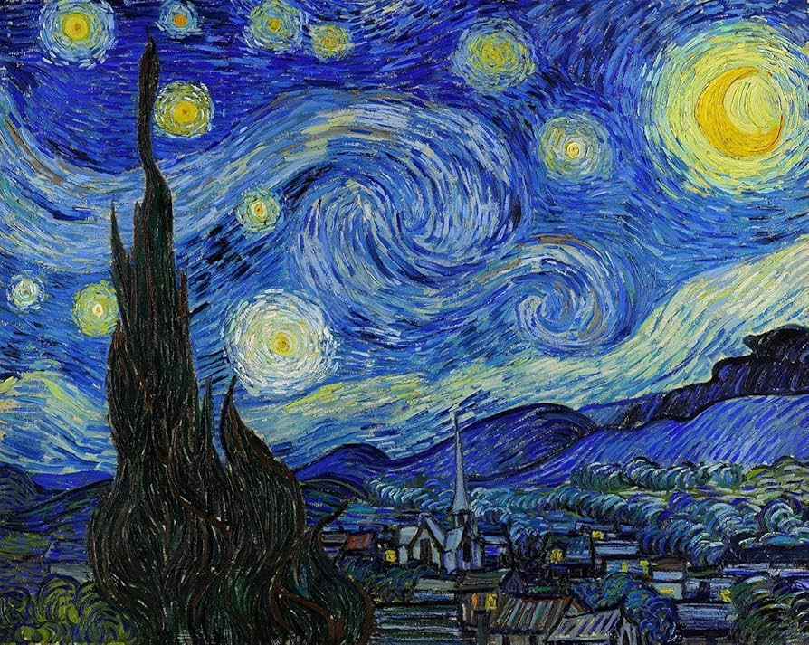
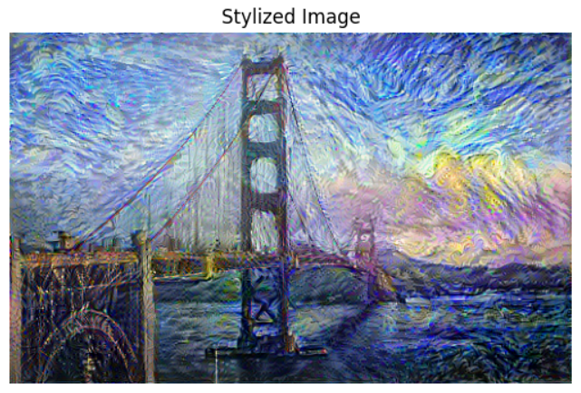
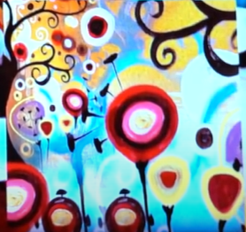
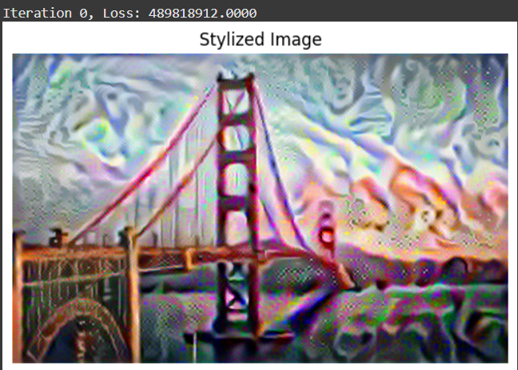
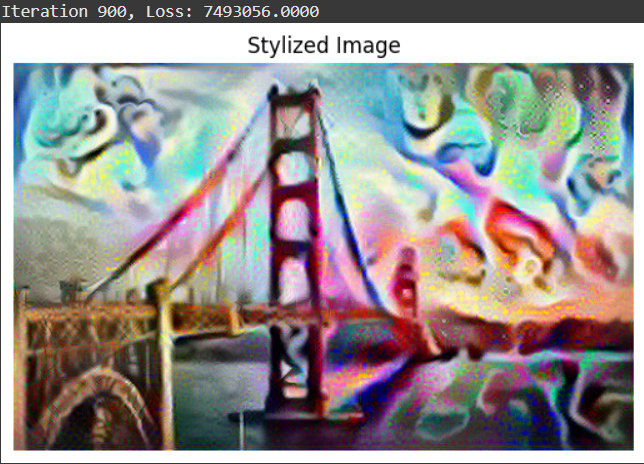
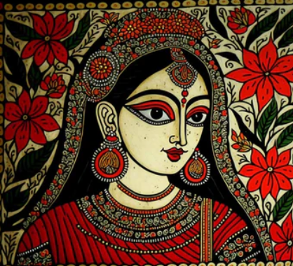
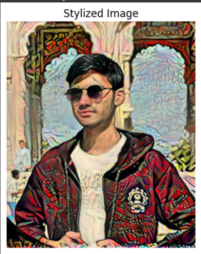
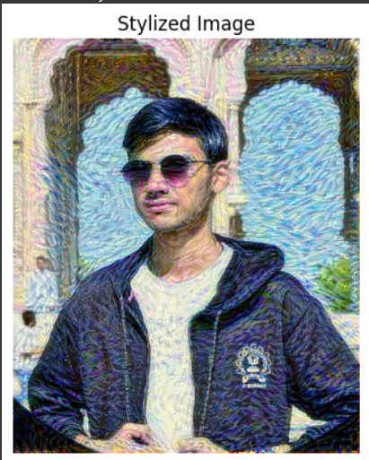

# SOC_visual_style_transfer_engine
### Results-

  
  <b style="font-size: 24px;"> + </b>
  
  <b style="font-size: 24px;"> = </b>
  

## Zero iterations

  
  <b style="font-size: 24px;"> + </b>
  
  <b style="font-size: 24px;"> = </b>
  

## 900 iterations

  
  <b style="font-size: 24px;"> + </b>
  
  <b style="font-size: 24px;"> = </b>
  

  
  <b style="font-size: 24px;"> + </b>
  
  <b style="font-size: 24px;"> = </b>
  

  
  <b style="font-size: 24px;"> + </b>
  
  <b style="font-size: 24px;"> = </b>
  

